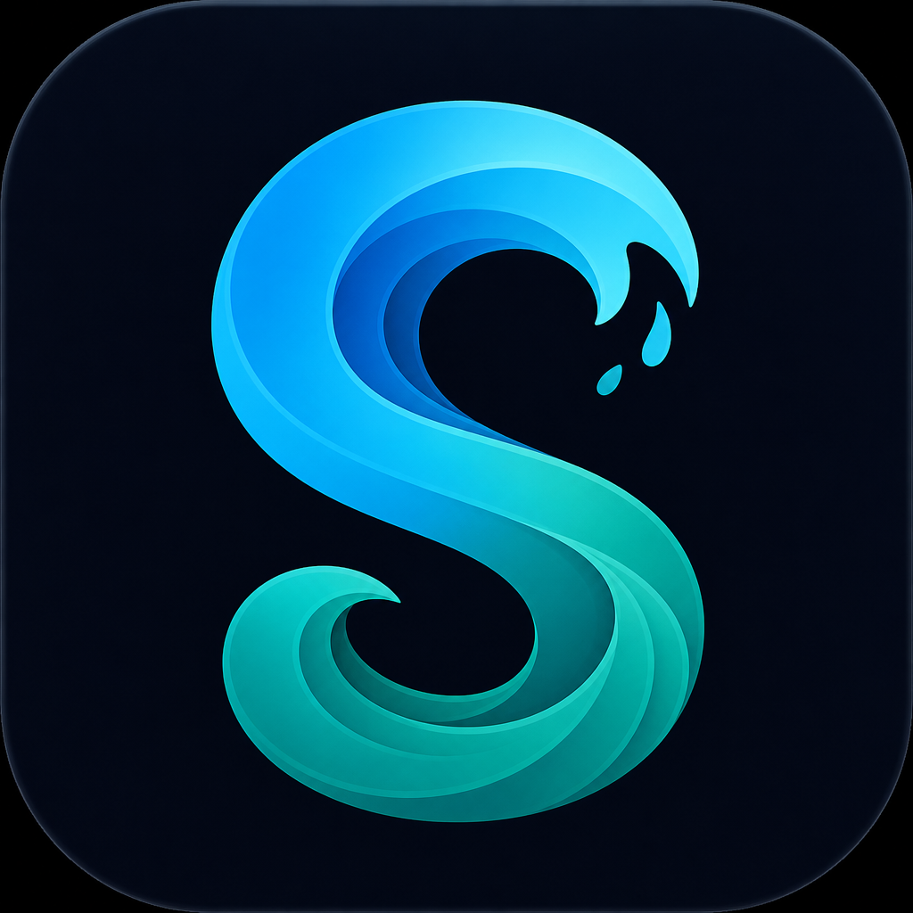

# 🛹 FED Play

> **The ultimate app store for websites without official apps.**
> A sleek, dark-mode-first web app store that catalogs sideloadable APKs across apps, games, movies, creative tools, utilities, and FED Originals — with featured heroes, a trending carousel, live search, category chips, and a premium subscription flow (PayPal + Stripe).

<p align="center">
  
</p>

---

## ✨ Features

- **🧩 58 apps cataloged** across six categories — Creative, Games, Movies & TV, Social, Utility, and Extensions.
- **📱 App Store for the "missing"** — a dedicated tab for sites that have no official app (DeviantArt, ArtStation, Behance, Midjourney, and more).
- **🔥 Featured hero + live trending carousel** — every page can declare its own `featuredIds` and grid title via a tiny `window.FED_PAGE` config block.
- **🔎 Instant client-side search** with debounced filtering and a live results count.
- **🎨 Multi-color category buttons** — each category gets its own accent color (premium, private, app-store, featured variants too).
- **🌙 Dark / light theme toggle** with persistence, dark mode default.
- **💳 Premium subscription modal** — holographic PayPal + Stripe checkout with a one-injection shared layout.
- **🧱 Lean HTML** — every page only contains its unique body content; the top bar, categories bar, toast system, back-to-top button, sidebar, and payment modal are all injected by `layout.js`.
- **📲 Sideload-ready download links** sourced per app, surfaced with one-tap "Get" buttons and toast feedback.

---

## 🚀 Quick Start

FED Play is a **zero-build, static front end**. Clone and open.

```bash
git clone https://github.com/YOUR_USERNAME/fed-play.git
cd fed-play
# Option A — just open index.html in a browser
open index.html        # macOS
xdg-open index.html    # Linux
start index.html       # Windows

# Option B — serve locally (recommended, avoids file:// quirks)
python3 -m http.server 8080
# then visit http://localhost:8080
```

No dependencies, no install step, no build tool. See **[INSTALL.md](INSTALL.md)** for detailed setup and **[BUILD.md](BUILD.md)** for the (minimal) build notes.

---

## 📂 Project Structure

```
fed-play/
├── index.html          # App Store / hub (trending + most wanted)
├── games.html          # 🎮 Games tab
├── movies.html         # 🎬 Movies & TV tab
├── creative.html       # 🎨 Creative tab
├── utility.html        # 🛠️ Utility tab
├── premium.html        # ⚡ Premium catalog
├── private.html        # 🔒 Private / gated apps
├── appstore.html       # 📲 App Store apps (the official ones)
├── fed-originals.html  # 🌟 FED Originals
├── missing.html        # 📨 Missing-apps (no official app)
│
├── data.js             # APPS[] — the single shared catalog (58 entries)
├── app.js              # FED module — rendering, search, toasts, modal logic
├── layout.js           # FED_LAYOUT module — injects top bar, sidebar, modal, footer
├── styles.css          # Shared stylesheet, design tokens, dark/light themes
├── surf-fed-logo.png   # Brand logo
│
├── .github/            # Issue templates, PR template, discussion welcome, prompts, wiki
└── docs/               # ADR, roadmap, deployment, build, install, summary
```

### How a page works

Every HTML page follows the same three-step pattern:

```html
<script src="data.js"></script>
<script src="layout.js"></script>
<script src="app.js"></script>
<script>
  window.FED_PAGE = {
    tab: 'apps',                       // which sidebar tab is active
    featuredIds: ['deviantart', 'kofi', 'fedplay', 'seeflix'],
    gridTitle: '📦 Most Wanted',
    gridSub: 'sideload ready',
    welcome: 'the ultimate app store'
  };
  FED_LAYOUT.inject();   // injects chrome (top bar, sidebar, modal, footer)
  FED.init();            // renders chips, featured, carousel, grid, search
</script>
```

Add a new page by copying any existing one and changing `window.FED_PAGE`.

---

## ➕ Adding an App

Apps live in **`data.js`** as entries in the `APPS[]` array:

```js
{
  id: "myapp",                 // unique slug, also used in featuredIds
  name: "My App",
  category: "creative",        // creative | games | movies | social | utility | extensions
  featured: false,             // show in featured hero rotation?
  rating: 4.8, reviews: "2.1k",
  description: "Short one-liner shown on the card.",
  downloadUrl: "https://example.com/app.apk",
  editorsChoice: false,
  isPremium: false,            // gates behind the subscription modal
  isPrivate: false,            // gates behind private access
  isAppStore: false,           // official app-store listing style button
  tags: ["apps", "creative"],  // which tabs/grid this app appears on
  imageUrl: "https://...icon.png"
}
```

The `tags` array controls visibility across tabs (`apps`, `games`, `movies`, `creative`, `fed_originals`, `missing`, `premium`, `private`, `appstore`). An app can belong to several tabs at once.

See **[CONTRIBUTING.md](CONTRIBUTING.md)** for the full submission workflow.

---

## 💖 Support the Project

<a href='https://ko-fi.com/YOUR_USERNAME' target='_blank'>
    
</a>

If FED Play saves you time, consider buying me a coffee on **[Ko-fi](https://ko-fi.com/YOUR_USERNAME)** — every cup funds new app entries, hosting, and the occasional late-night commit. You can also subscribe to **FED Play Premium** right inside the app via the ⚡ Subscribe button (PayPal or Stripe).

---

## 🤝 Contributing

Contributions are welcome — new apps, bug fixes, UI polish, accessibility, new tabs. Please read **[CONTRIBUTING.md](CONTRIBUTING.md)** first, then open an issue to discuss what you'd like to change before sending a PR. Use the issue templates in `.github/ISSUE_TEMPLATE/` so we can triage fast.

---

## 📜 License

FED Play is released under the **MIT License** — see **[LICENSE](LICENSE)** and **[COPYING.md](COPYING.md)**. The cataloged APK icons and download links belong to their respective owners and are referenced, not redistributed.

---

## 📚 Documentation

| Doc | What's inside |
|-----|---------------|
| [INSTALL.md](INSTALL.md) | Detailed local setup & serving |
| [BUILD.md](BUILD.md) | (Minimal) build notes & asset pipeline |
| [DEPLOYMENT.md](DEPLOYMENT.md) | Deploying to static hosts |
| [ROADMAP.md](ROADMAP.md) | Where the project is headed |
| [ADR.md](ADR.md) | Architecture Decision Records |
| [CHANGELOG.md](CHANGELOG.md) | Release history |
| [FAQ.md](FAQ.md) | Common questions |
| [SECURITY.md](SECURITY.md) | Reporting vulnerabilities |
| [SUPPORT.md](SUPPORT.md) | Getting help |

---

<p align="center">
  <sub>Built with 🩵 by the FED Play community. Sideload responsibly.</sub>
</p>
